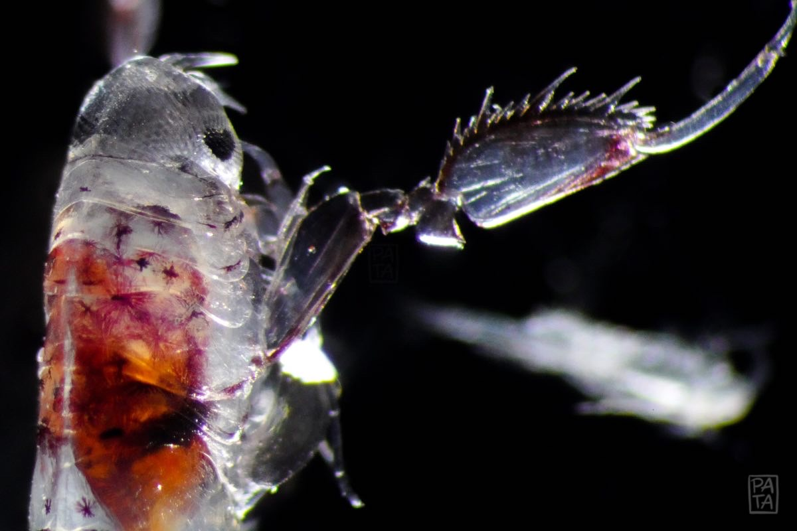

### Hello! 👋👋👋

I am a biological oceanographer and currently a PhD candidate at the University of British Columbia in the [Pelagic Ecosystems Laboratory](https://pelagicecosystems.oceans.ubc.ca/). This GitHub page stores my scripts and data. My research is generally on the physical and ecological mechanisms that structure the distribution of life. Particularly, I study marine zooplankton which include a diversity of animals from microscopic crustaceans, to jellyfish, to the larvae of larger organisms like corals and fishes. Understanding why different kinds of zooplankton are found in different parts of the ocean during particular periods of time is important for the phytoplankton that they eat, the fishes and whales that eat them, the habitats they form, and the carbon that they transport from the surface of the ocean to the deep. AND zooplankton look super cool and cute and alien and gorgeous! 

- 🌊 I am currently working on a project on the Bioregionalization of the Northeast Pacific Ocean based on [zooplankton taxonomy](https://github.com/Pelagic-Ecosystems/BC_Zooplankton_Bioregionalization) and functional ecology.
- 🦀 I am continuing to develop a [Global Zooplankton Trait Database](https://github.com/Pelagic-Ecosystems/Zooplankton_trait_database). If you would like to help me expand and polish this database or need support in using it, please reach out!
- 🐠 Previously, I've worked on the larval connectivity of fish populations and [coral reefs](https://github.com/biome-upmsi/Philippine-connectivity) to help inform conservation and management.
- 🦑 In my free time, I enjoy nature, art, and [making art](https://www.instagram.com/patrickpasta/). Check out this small public repo of [zooplankton line art](https://github.com/PatrickPata/Marine-organism-line-art) which I use in making figures and presentations.
- 🏄 The methodological tools I often use are numerical ecology, individual-based modelling, satellite imagery, and ocean circulation modelling. I write code in R, Matlab, Java, and Python.
- 🚣 If you are keen on collaborating, I am always looking for new collaborators! 

✨ We are hosting a workshop on zooplankton traits ✨ on March 2024 at Hobart, Australia. Follow [this link](https://meetings.pices.int/meetings/international/2024/zps7/program#w5) for details. 

